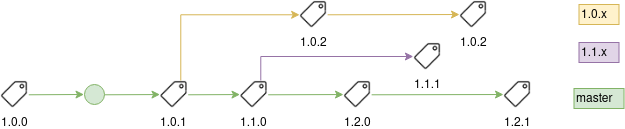

Releasing Xill
--------------

If head of the branch has to be updated, simply [doing the version dance](version-dance.sh) is enough.

If the release is NOT on the head of the branch you have to create a release branch so that the diagram below remains
true:

> **Note:** According to the diagram above, we DO NOT create a release branch unless we need to patch a historic release.
