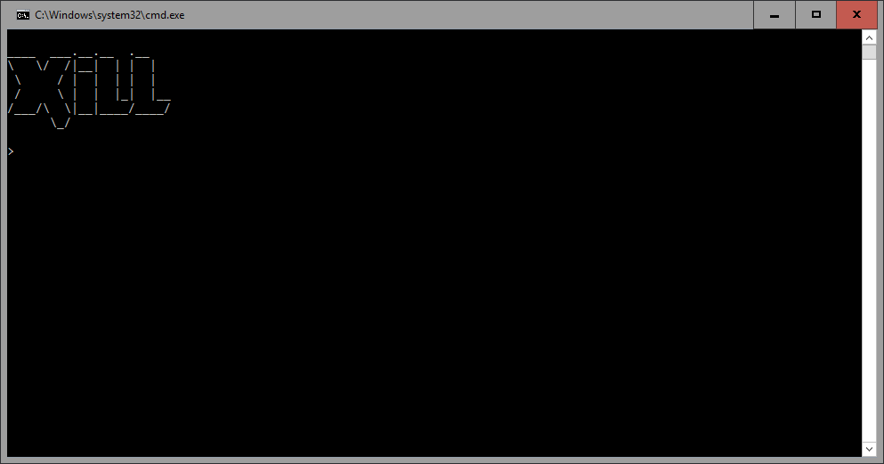
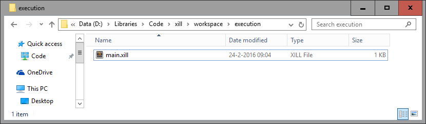
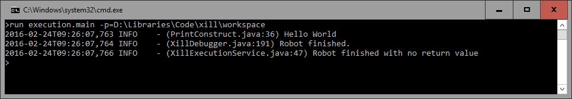

# Product : Xill CLI

Xill CLI provides a way to run xill robots from the command line. It is a console client that allows you to type commands to run specific robots in sequence.

## Features

The main feature provided by xill CLI is **running robots**. You can run robots across multiple projects using this tool. See the section about Running Robots for some examples.


## Getting Started

To be able to use Xill CLI you will first require an installation of Xill which comes with Xill IDE. The path to this installation is important. For the sake of convenience, we will call this _XILL_HOME_ on this page.

Tip

You can set the XILL_HOME environmental variable to this path to skip the full initialization procedure.


### Launch the Application

To launch the application, double-click _xill.bat_ (or _xill_ if you are on a unix machine). This will open the Xill CLI application. At this point you will be able to run commands any commands that are available.

To list the commands run `help.`




### Initialization Procedure

To be able to run robots you will first have to initialize the environment. You can do this using the `init` command followed by the path to the root folder of the xill installation. (This is the folder mentioned above as XILL_HOME.) You can skip this step if you have your XILL_HOME variable set. Running this command will detect all installed plugins and prepare the environment for execution.


### Running a robot

You can run a robot using the `run` command.

Say we have a project folder at `D:\Libraries\Code\xill\workspace` that contains a folder called `execution` and in it you will find a robot called `main.xill.`

Now we can use Xill CLI to run this robot by running the command:


```run execution.main -p=D:\Libraries\Code\xill\workspace```

Here you can see we provide the fully qualified name of the robot we want to run and the path to the project using the `-p` flag. If you do not provide the `-p` flag then the project path will default to the current working directory.


